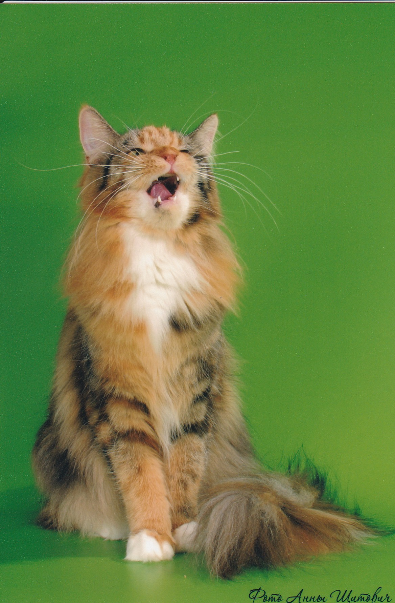

# Инструкция для работы с MD
## Выделение текста
Чтобы выделить текст курсивом необходимо обрамить его звездочками * или знаком_

_пример_

*пример*

Чтобы выделить текст полужирным необходимо обрамить его двуми зваездочками или двумя _

__пример__

 **пример**

Алтернативные способы выделения текста жирным или курсивом нужна, чтобы можно было совмещать. 

_текст выделен **по-разному**_

## Списки

Чтобы добавить ненумерованные списки, выделяем пункты * или знаком 

* 1
* 2
* 3

Чтобы добавить нумерованные списки пункты просто нумеруем
1. Раз
2. Два
3. Три

## Работа с изображением

Чтобы вставить изображение в текст достаточно написать следующее: 

## Ссылки
## Таблицы
## Цитаты
## Заключение